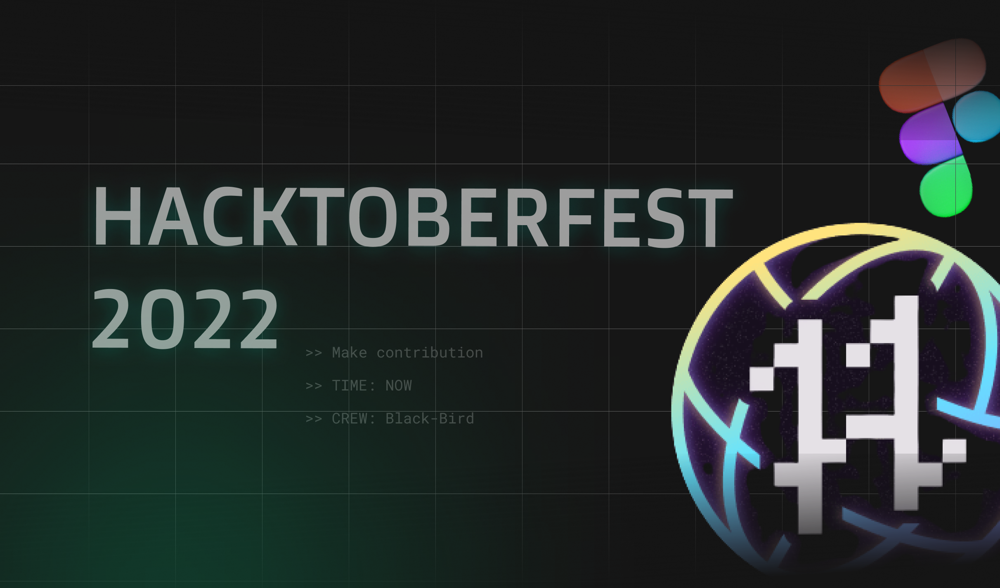

# 🚀 css-awesomeness

This project is for hacktoberfest to encourage new developer and open source developers to contribute to open source and improve skills which require debugging, write testable code, industry standards, problem solving and many more,

## 💙 For contributors

Please read the following before contributing to the repository:

- [Contribution Guide](./CONTRIBUTING.md)
- [Code of Conduct](./CODE_OF_CONDUCT.md)
- [Licence](./LICENCE.md)

## 💻 Projects

 
- [3d-layer-loader](./projects/3d-layer-loader) 
- [Animated_Button_Dipesh](./projects/Animated_Button_Dipesh) 
- [Parser for CPP](./projects/cpp_parser/)
- [Shell Implementation in CPP](./projects/ceyshell/)
- [Deadlock & Synchronization Solution](./projects/process_synchronization/)
- [Bubble Coloring Animated Button Template](./projects/Bubble Coloring Animated Button Template) 
- [Budget-Planner](./projects/Budget-Planner) 
- [CSS Marquee](./projects/CSS Marquee) 
- [Diamond shape HTML &amp; CSS](./projects/Diamond shape HTML &amp; CSS) 
- [Dropdown HTML &amp; CSS](./projects/Dropdown HTML &amp; CSS) 
- [Dynamic Skills Bar For Portfolio HTML &amp; CSS](./projects/Dynamic Skills Bar For Portfolio HTML &amp; CSS) 
- [Film grain effect HTML &amp; CSS](./projects/Film grain effect HTML &amp; CSS) 
- [Glow on hover button HTML &amp; CSS](./projects/Glow on hover button HTML &amp; CSS) 
- [Interactive Checkbox](./projects/Interactive Checkbox) 
- [Order Card HTML CSS](./projects/Order Card HTML CSS) 
- [Progress Circle HTML CSS](./projects/Progress Circle HTML CSS) 
- [Ripple Button](./projects/Ripple Button) 
- [Rotating animation](./projects/Rotating animation) 
- [Social Media Link Bar HTML &amp; CSS](./projects/Social Media Link Bar HTML &amp; CSS) 
- [Social media follower countdown](./projects/Social media follower countdown) 
- [Sonar Radar](./projects/Sonar Radar) 
- [Tamosa_Css_button](./projects/Tamosa_Css_button) 
- [Typography](./projects/Typography) 
- [animated-button](./projects/animated-button) 
- [animated-countdown](./projects/animated-countdown) 
- [animated-counter](./projects/animated-counter) 
- [bar-loader](./projects/bar-loader) 
- [button-css](./projects/button-css) 
- [button-ripple-effect](./projects/button-ripple-effect) 
- [calculator](./projects/calculator) 
- [calculator.css](./projects/calculator.css) 
- [ceyshell](./projects/ceyshell) 
- [checkbox-animation](./projects/checkbox-animation) 
- [cpp_parser](./projects/cpp_parser) 
- [custom-checkbox](./projects/custom-checkbox) 
- [custom-radio-button](./projects/custom-radio-button) 
- [dad-jokes](./projects/dad-jokes) 
- [dice-loader](./projects/dice-loader) 
- [drink-water](./projects/drink-water) 
- [faq-collapse](./projects/faq-collapse) 
- [finger-scan-css](./projects/finger-scan-css) 
- [folded-card](./projects/folded-card) 
- [hamburger-menu](./projects/hamburger-menu) 
- [hidden-search](./projects/hidden-search) 
- [hover-card](./projects/hover-card) 
- [loader-dots](./projects/loader-dots) 
- [loader_dots](./projects/loader_dots) 
- [movie-app](./projects/movie-app) 
- [namita-portfolio](./projects/namita-portfolio) 
- [notes-app](./projects/notes-app) 
- [password-generator](./projects/password-generator) 
- [portfolio](./projects/portfolio) 
- [progress-loader](./projects/progress-loader) 
- [random-quote](./projects/random-quote) 
- [resposive-card](./projects/resposive-card) 
- [rock-paper](./projects/rock-paper) 
- [shell](./projects/shell) 
- [slider-loader](./projects/slider-loader) 
- [wave-loader](./projects/wave-loader)

## 😎 Maintainer

<table>
  <tr>
    <td align="center">
      
       
       Shikhar Gupta
       
      <a href="https://www.linkedin.com/in/shikhar-gupta-71ab59201/">LinkedIn</a>
      <a href="https://github.com/shikhar13012001">Github</a>
    </td> 
  </tr>
</table>

## 📄 License

[MIT](./LICENSE.md)

 
 
 

(If you liked the project, please give it a star 😃)

